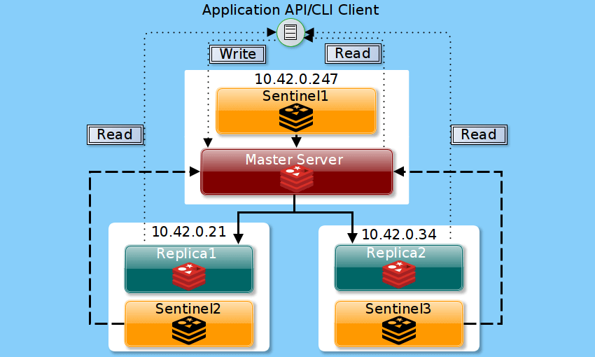

## ActiveMQ

## JBossEAP

## Keycloak

## ElasticSearch

## Redis
https://redis.io/topics/sentinel  
For HA setup, basic setup with three boxes running both Redis and Sentinal.  

https://www.tecmint.com/setup-redis-high-availability-with-sentinel-in-centos-8/  
**NOTE**: there is already a line of "sentinel monitor mymaster 127.0.0.1 2", replace the ip.
Use "journalctl -xe" command to view service error message.

## MySQL
