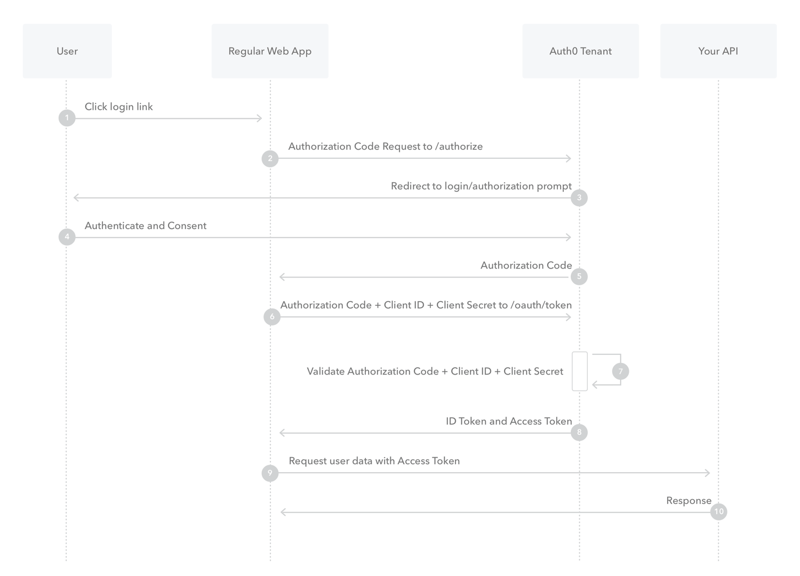

## Concept
https://aaronparecki.com/oauth-2-simplified/  
https://developer.okta.com/blog/2019/10/21/illustrated-guide-to-oauth-and-oidc  
OAuth2 is a delegated authorization protocol
- Resource Owner
- Resource Server
- Client
  - Client ID
  - Secret (must be kept confidential)
  - RedirectUrl
- Authorization Server (know Resource Owner)  
  Sometimes the “Authorization Server” and the “Resource Server” are the same server.

## Grant Type  
https://alexbilbie.com/guide-to-oauth-2-grants/
- Authorization Code  
  suitable for Web Server Apps, flow:  
  - Client redirect to Authorization Server
  - Authorization Server return Authorization Code
  - Client exchanges the authorization code for an access token by making a POST request (include the Secret) to the authorization server's token endpoint.
  - The server replies with an access token and expiration time.  
  

- Authorization Code with PKCE  
  secret is not used in this case. The flow is based on the authorization code flow above, but with the addition of a dynamically generated secret used on each request.
  Use Random secret and hash.

- Cleint Credentials  
  For Server-to-Server communication. In some cases, applications may need an access token to act on behalf of themselves rather than a user.  
  

- Password  
  Since this obviously requires the application to collect the user's password, it must only be used by apps created by the Authorization Service itself. e.g. Twitter login.  

- ~~Implicit~~ (Obselete, relaced by PKCE)  

The end result of all the grant types is obtaining an access token.  
https://www.oauth.com/oauth2-servers/access-tokens/self-encoded-access-tokens/  

## Access Token Validation  
https://developer.okta.com/docs/guides/validate-access-tokens/dotnet/overview/  
- Local validation
- Remote validation with Authorization Server  
  using the Token Introspection endpoint.  
  This incurs a network request which is slower to do verification, but can be used when you want to guarantee that the access token hasn't been revoked.

## Access Token Generation
- Self-encoded token  
  A common technique for this is using the JSON Web Signature (JWS) standard to handle encoding, decoding and verification of tokens.  
  The main benefit of this is that API servers are able to verify access tokens without doing a database lookup on every API request.
- Token stored in database  
  Generate random strings and store them in a database along with the associated user and scope information.

```json
// sample access token
HTTP/1.1 200 OK
{
  "access_token":"MTQ0NjJkZmQ5OTM2NDE1ZTZjNGZmZjI3",
  "token_type":"bearer",
  "expires_in":3600,
  "refresh_token":"IwOGYzYTlmM2YxOTQ5MGE3YmNmMDFkNTVk",
  "scope":"create"
}

// sample unsuccess response
HTTP/1.1 400 Bad Request
{
  "error": "invalid_request",
  "error_description": "Request was missing the 'redirect_uri' parameter.",
  "error_uri": "See the full API docs at https://authorization-server.com/docs/access_token"
}
```
## OAuth2 Implmentation
https://github.com/Baeldung/spring-security-oauth

## Testing
http://callistaenterprise.se/blogg/teknik/2015/04/27/building-microservices-part-3-secure-APIs-with-OAuth/
