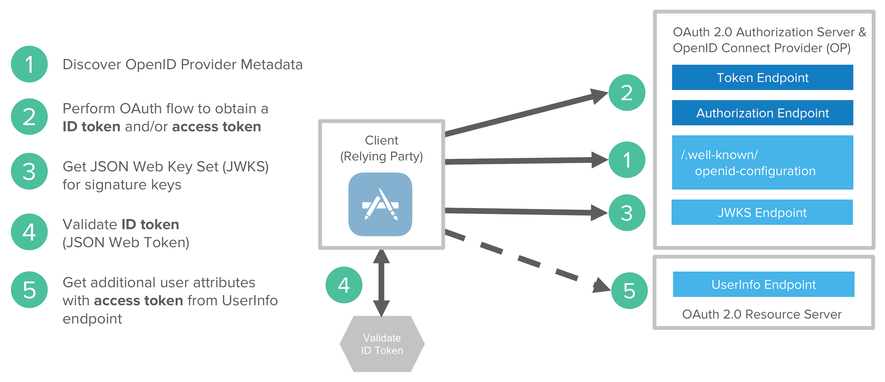

## Concept  
OpenID Connect (OIDC) is a thin layer that sits on top of OAuth 2.0 that adds login and profile information about the person who is logged in.  
- Identity
- Identity Provider

## Flow
The OpenID Connect flow looks the same as OAuth. The only differences are, in the initial request, a specific scope of openid is used, and in the final exchange the Client receives both an Access Token and an ID Token.

## Endpoints  
https://developer.okta.com/docs/reference/api/oidc/#endpoints  

