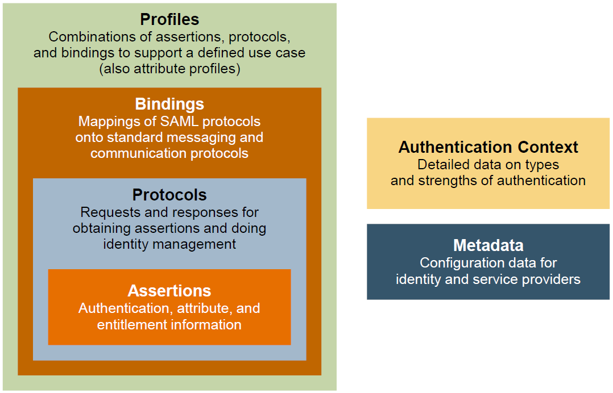

## Concept
https://duo.com/blog/the-beer-drinkers-guide-to-saml  

- Only for Web Application
- Subject/Principal (User/Machine)
- Service Provider (SP)
- Identity Provider (IdP, e.g. Microsoft AD or Azure)

- Assertions (SAML \<Assertion>)
  - Created by IdP.
  - Authentication assertion
  - Attribution assertion
  - Authorization decision assertion
- Protocols  
Protocols define how the requests and responses are exchanged between Service Provider and Identity Provider.  
e.g. [SPCP](spcp.md##SP2) uses the “Artifact Resolution” and “Artifact Response” protocols from the SAML specification.
- Bindings  
e.g. HTTP POST binding/SAML SOAP Binding (over HTTP)
- Profiles
  e.g. Artifact Resolution profile with IdP Redirect Artifact flow.  
- Metadata
  The parties must require agreements regarding identifiers, binding support and endpoints, certificates and keys, and so forth. A metadata specification is useful for describing this information in a standardized way.
- Authentication Context
  An authentication context declaration (using XML tags) inserted directly or referenced within the assertion.
