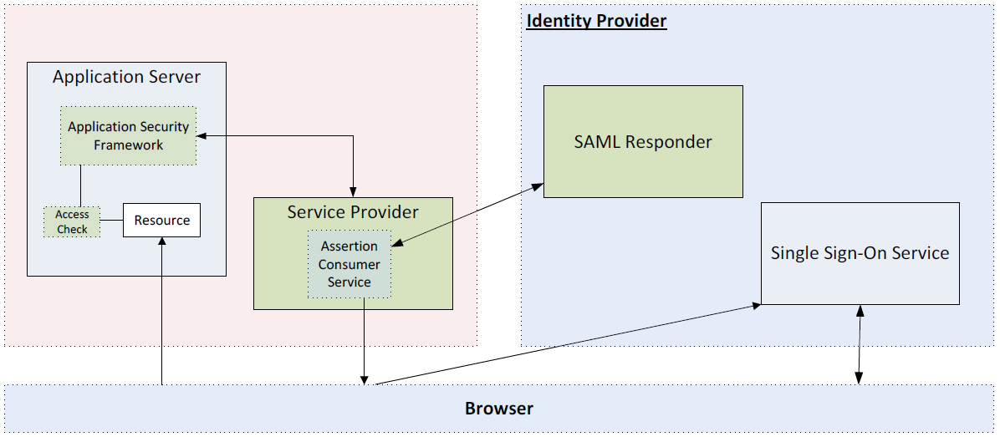

## SP1 (borrow idea from SSL)
Configuration
- IdP certificate is stored in Agency.
- IdP url is known to Agency.
- Agency certificate is stored in IdP.  
  
Flow  
- SP generate client_nonce, and send to IdP together with SP ID.
- IdP generate server nonce and session ID (**timeout in 5 minutes**). SessionKey from client nonce and server nonce.
- IdP send server nonce.
- SP send TargetUrl.
- SP Redirect user to IdP website.
- IdP do authencation, generate **ticket**, redirect to TargetUrl.
- SP send request (using ticket) to get authentication status.
- IdP **clear session** and return status.

## SP2 (SAML 2.0)  
Configuration
- X.509 Certificate for digital signature of SAML Messages
- X.509 Certificate for encryption of SAML Messages
- SSL Certificate for Artifact Resolution Service

Setup


Protocol (Flow)
- SP redirects the user to IdP (SPCP) with a return URL (to redirect back after authentication)
- IdP authenticates the user and sends the user back to SP’s return URL along with a single-use **SAML artifact**, which is a small piece of data.
- SP initiates “Artifact Resolution Protocol <ArtifactResolve>” to request artifact resolution from IdP.
  - use the OOB channel for retrieval of assertion which improves security.
  - browser cannot easily carry full message (i.e. the assertion) because of size constraints.
- IdP responds with “Artifact Response Protocol <ArtifactResponse> in which the IdP sends the **SAML Assertion** to SP, which includes:   
 \<saml:Issuer>\<ds:Signature>\<saml:Subject>\<saml:Conditions>\<saml:AuthnStatement>

## Sample SAML Message
SAML Assertion
```xml
<saml:Assertion
 xmlns:saml="urn:oasis:names:tc:SAML:2.0:assertion"
 xmlns:xs="http://www.w3.org/2001/XMLSchema"
 xmlns:xsi="http://www.w3.org/2001/XMLSchema-instance"
 ID="b07b804c-7c29-ea16-7300-4f3d6f7928ac" Version="2.0" IssueInstant="2004-12-05T09:22:05">

<saml:Issuer>https://idp.example.org/SAML2</saml:Issuer>

<ds:Signature xmlns:ds="http://www.w3.org/2000/09/xmldsig#">...</ds:Signature>

<saml:Subject>
  <saml:NameID Format="urn:oasis:names:tc:SAML:2.0:nameid-format:transient">
    3f7b3dcf-1674-4ecd-92c8-1544f346baf8
  </saml:NameID>
  <saml:SubjectConfirmation Method="urn:oasis:names:tc:SAML:2.0:cm:bearer">
    <saml:SubjectConfirmationData InResponseTo="aaf23196-1773-2113-474a-fe114412ab72" Recipient="https://sp.example.com/SAML2/SSO/POST" NotOnOrAfter="2004-12-05T09:27:05"/>
  </saml:SubjectConfirmation>
</saml:Subject>

<saml:Conditions NotBefore="2004-12-05T09:17:05" NotOnOrAfter="2004-12-05T09:27:05">
  <saml:AudienceRestriction>
    <saml:Audience>https://sp.example.com/SAML2</saml:Audience>
  </saml:AudienceRestriction>
</saml:Conditions>

<saml:AuthnStatement AuthnInstant="2004-12-05T09:22:00" SessionIndex="b07b804c-7c29-ea16-7300-4f3d6f7928ac">
  <saml:AuthnContext>
    <saml:AuthnContextClassRef> urn:oasis:names:tc:SAML:2.0:ac:classes:PasswordProtectedTransport </saml:AuthnContextClassRef>
  </saml:AuthnContext>
</saml:AuthnStatement>

<saml:AttributeStatement>
  <saml:Attribute xmlns:x500="urn:oasis:names:tc:SAML:2.0:profiles:attribute:X500" x500:Encoding="LDAP" NameFormat="urn:oasis:names:tc:SAML:2.0:attrname-format:uri" Name="urn:oid:1.3.6.1.4.1.5923.1.1.1.1" FriendlyName="eduPersonAffiliation">
    <saml:AttributeValue xsi:type="xs:string">member</saml:AttributeValue>
    <saml:AttributeValue xsi:type="xs:string">staff</saml:AttributeValue>
  </saml:Attribute>
</saml:AttributeStatement>
</saml:Assertion>
```