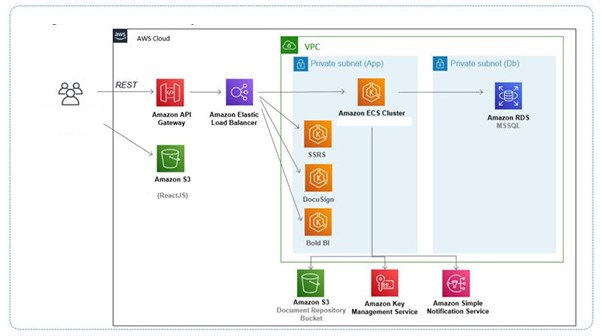

## Design

**CDN**  
CloudFront or CloudFlare  
Company uses CloudFlare. In the end, CloudFront with Lambda@Edge is also used as need to inject security HTTP headers for S3.

**Web Tier**  
HTTP API Gateway or Internet Application Load Balancer  
Even though API Gateway can proxy S3 by /{proxy+} -> s3_url/{proxy}, it is not recommended as cost and performance impact incurred.

HTTP API Gateway is chosen as need to front the APIs.

**Internet Access for ECS**  
Public subnet or Interface Endpoint  
Interface Endpoint is chosen because of its performance.

**App Tier**  
EC2 or Fargate  
- Fargate can only use awsvpc Network Mode, which each service will use one Elastic Network Interface unless enable the “awsvpc Trunking” feature.
- Fargate is not under Free Tier  
  
EC2 is chosen.

**Service Discovery**  
Cloud Map or Load Balancer
- Cloud Map using Route 53 to store the name and IP (SRV record for bridge mode, A record for awsvpc mode)  
CloudMap is a tool to register and organize service instances by service. Route53 is a DNS endpoint that can expose those service instances registered with CloudMap. Load balancing doesn't come into play with those two tools.

Application can only resolve the name if it is DNS A record 
but need AWS SDK or DNS SDK to retrieve the IP, the name cannot be auto resolved by application.

If you are using a Java-based compute stack, you might not want to choose DNS-based service discovery as the JVM caches DNS name lookups. When the JVM resolves a hostname to an IP address, it caches the IP address for a specified period of time, TTL. In such cases, you could use API-based service discovery and leverage the same approach as your other microservices that can use AWS Cloud Map

When you make a call to Route53 (or any DNS) it will return a list of IPs that match the given host name you requested. Client side logic will then make a decision as to which IP to use, usually just selecting the top item in the list. When utilizing client side load balancers, such as Envoy proxy, it has more complicated logic when selecting which IP to make the call to.

https://pattern-match.com/blog/ecs-service-discovery-in-java/

If you use Amazon ECS to populate entries in AWS Cloud Map, you must configure your Amazon ECS task to use SRV records. "A" records aren't supported.

Java’s subsystem doesn’t resolve SRV records by default. Need aws-java-sdk-servicediscovery

In the end, the proposed solution is still using internal ALB to front the microservices. To use fixed name for ALB is to create a CNAME.

https://stackoverflow.com/questions/56897754/not-able-to-make-aws-ecs-services-communicate-over-service-discovery

Proposed AWS solution:
 
## Setup
The setup is a POC for proposed AWS solution.

**Push image to AWS ECR**  
- Create admin user, log the access key ID and secret access key
- Run aws cli: aws configure (using the above credentials)
- Create aws public/private registry for each docker image.
e.g. "mainservice" and "service1"
- Select the registry and select "view push commands"
- Run the commands in popup screen in AWS CLI

https://docs.aws.amazon.com/AmazonECR/latest/userguide/docker-push-ecr-image.html  
https://docs.aws.amazon.com/AmazonECR/latest/userguide/getting-started-console.html

**Setup VPC**  
Create VPC with 2 public subnet and 2 private subnet (public subnet is not required if using privatelink, 2 subnet is need for ALB)
https://docs.aws.amazon.com/AmazonECS/latest/developerguide/create-public-private-vpc.html 

**Create Interface Endpoints in VPC (when not use NAT)**  
Interface endpoints is required for ECS: 
- ECR x 2
- S3 Gateway
- (EC2) ECS x 3
- (Fargate) Secret Manager
- (CloudWatch) logs  
  
Remember to choose the correct subnets, Security  Group, Policy and route table (for S3 Gateway)

**Create Load Balancer**
- Application load balancer with sticky session.
- Define different path rule for different service which running in separate Target Group. E.g. /service1/* and /service1 forward to tg-service1

**Setup Route 53**
- Create a private hosted-zone for VPC
- Create a CNAME record for Internal Load Balancer so that the inter-service communication can rely on the CNAME record instead of Load Balancer DNS

**Setup Bastion EC2**  
- Copy the Jumpbox private key to Jumpbox.  Use Notepad to open the jumpbox.pem, copy and paste to id_rsa
- sudo ssh -i id-rsa ec2-user@10.0.1.41

**Setup ECS services**  
https://aws.amazon.com/premiumsupport/knowledge-center/dynamic-port-mapping-ecs/

Register a task definition  
(EC2) Network Mode: awsvpc is recommended by AWS. In this mode, each task will be assigned an ENI. However for testing, when we are using t2.micro which only support can only two ENI, it can only run one task on one node (1 ENI is used by VM, so only left one ENI for running task).
So there are two options
  - Network mode use “Bridge” so that multiple container can run in the same t2.micro EC2 instance (but need to use dynamic port mapping)
  - Run one task in one instance
https://docs.aws.amazon.com/AmazonECS/latest/developerguide/getting-started-ecs-ec2.html  

Refer to taskdef-mainservice.json for task configuration
- Define CPU Unit and Memory
- Define environment variables
- Define logging
- (Fargate) Create log group and logs endpoint for cloudwatch  

**Create ECS Cluster**  
https://docs.aws.amazon.com/AmazonECS/latest/developerguide/create_cluster.html  
Choose two instances and 2 private subnets.  
Remember to check security group for ALB to access the instances (enable 8080 for SpringBoot applications) 
- (Optional) Create Task directly to test.
- Create ECS Services

**Update Image (for testing)**  
- Follow the steps to push image to ECR
- Create new revision of task definition
- Select service and click “UPDATE” to new revision
- Stop the service
- After a few minutes, Check “tasks” tab in Cluster, the tasks will be running using new task definition.
- Check Target Group targets status is “healty”. Sometimes, health check endpoint must be ended with backslash /hc/, remember to click “refresh” icon to update the health status.

**Setup API Gateway**  
- Create Route to load balancer, since the routing is happen at Load Balancer side, so don’t need multiple route, just proxy to load balancer.
ANY /{proxy+} -> load_balancer
- Enable CORS in API Gateway (Access-Control-Allow-Headers value must be “Authorization, *” instead of “*”)
OPTIONS /{proxy+} -> set to no integration
- Enable logging to CloudWatch for troubleshooting ($context.integrationErrorMessage)

**Setup S3**  
https://aws.amazon.com/getting-started/projects/build-serverless-web-app-lambda-apigateway-s3-dynamodb-cognito/module-1/
https://stackoverflow.com/questions/53938053/s3-hosting-api-gateway  

**Setup CloudFront**  
For ReactJS application, set 403 error page to index.html.

To add HTTP header use Lambda@Edge, apply it to Origin Response.

**Setup RDS**  
- Need to create a public subnet and create a subnet group after that
- Choose different version if free tier not available for the latest version (e.g. SQLServer Express 2017 has a free tier, while 2019&2012 is not)

**Clean Up**  
- Set ECS AutoScale group to 0
- Delete NAT Gateway (NOT free)
- Stop all EC2 instances (t3.micro NOT free)
- Release Elastic IP address
- Delete VPC endpoints (NOT Free, 0.013 Per Hour)
- Delete Route 53 Hosted Zones (Delete within 12 Hours it is free)
- Delete Load Balancer
- Stop database
- Remember to check the Billing everyday

## CICD
https://docs.aws.amazon.com/codepipeline/latest/userguide/tutorials-ecs-ecr-codedeploy.html#tutorials-ecs-ecr-codedeploy-pipeline
- Define load balancer for ECS service
This will make the tasks automatically register themselves to Target Group.
- Can use standard deployment or Green-Blue deployment, which is specified both in Service and the pipeline stage.
  - Amazon ECS standard deployments require an imagedefinitions.json file as an input to the deploy action.
For standard deployment, need to create imagedefinitions.json file in CodeCommit repository.
  - Amazon ECS blue/green deployments require an imageDetail.json file as an input to the deploy action.
Amazon ECR source actions generate an imageDetail.json file that is provided as an output from the source action.
- Define Green-Blue deployment for creating ECS service.
  - Green-Blue means two target group will be used.
Once the deployment successful, CodeDeploy will automatically update the LB routing rules to point to new deployed target group.
  - One CodeDeploy application & deployment group will be created automatically.
- How pipeline works:
  - When there is a new Image uploaded to ECR.
  - CloudWatch event will be trigger the pipeline.
  - Source stage: CodeCommit and IMAGE artifact will be generated and put in S3 as input for deploy stage.o	
  - Deploy stage: Deployment will be triggered.

## Troubleshooting  
**Error**: The ELB could not be updated due to the following error: Primary taskset target group must be behind listener <elb arn>
Solution:  
https://forums.aws.amazon.com/thread.jspa?threadID=316383

## Logging  
There are multiple solutions for Application logging:  

**CloudWatch Log defined in task definition**  
Implementation:
Define logging in task container definition. 
      "logConfiguration": {
        "logDriver": "awslogs",
        "options": {
          "awslogs-group": "/ecs/mainservice",
          "awslogs-region": "ap-southeast-1",
          "awslogs-stream-prefix": "ecs"
        }
      },
NOTE: a new log stream with suffix of task-id will be created for each new task.
Pros:
- Don’t need to change program, just configure application log output to stdout (using stdout is actually one of the best practices in cloud logging)
Cons:
- Too many logs mixed

**Use CloudWatch version Application logger**  
Implementation:
Include logging library (e.g. Log4j-cloudwatch, serilog-cloudwatch) in application. 
Pros:
- Can write application logs to specific log group
Cons:
- Need to change the logger (How to handle different environment)

**Use EFS to store log files**  
Implementation:  
Define Volume (point to EFS) in ECS task definition
   ```json
  "volumes": [
    {
      "efsVolumeConfiguration": {
        "fileSystemId": "fs-975180d7",
        "transitEncryption": "ENABLED",
        "rootDirectory": "/"
      },
      "name": "efs-logs"
    }
  ]
  ```
Define MountPoint in in ECS task container definition
   ```json
      "mountPoints": [
        {
          "containerPath": "/var/logs",
          "sourceVolume": "efs-logs"
        }
      ]
  ```
Define log file location in environment variable (SpringBoot Sample)
   ```json
        {
          "name": "logging.file.name",
          "value": "/var/logs/mainservice.log"
        },
  ```
SSH to EC2 instances and mount EFS to get files  
```sh
sudo ssh -i id-rsa ec2-user@10.0.2.20
sudo mkdir /mnt/efs
sudo mount -t nfs -o nfsvers=4.1,rsize=1048576,wsize=1048576,hard,timeo=600,retrans=2,noresvport fs-975180d7.efs.ap-southeast-1.amazonaws.com:/ /mnt/efs
df -T
```

