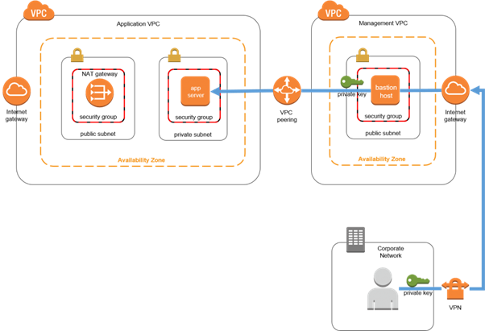

## VPC

## Subnet
- Public Subnet: associated with a route table that has a route to an internet gateway.
- Private Subnet: no route to internet gateway

## EC2
Access Internet
- Have a public IP address and in public subnet
- (or) Have NAT and private ip ddress

## Bastion

## AWS Microservice Architecture
https://docs.aws.amazon.com/whitepapers/latest/microservices-on-aws/microservices-on-aws.html#introduction-section
https://aws.amazon.com/blogs/architecture/field-notes-integrating-http-apis-with-aws-cloud-map-and-amazon-ecs-services/

## CloudFront
https://aws.amazon.com/premiumsupport/knowledge-center/cloudfront-distribution-serve-content/
Add response header for CloudFront using Lambda@Edge
https://docs.aws.amazon.com/AmazonCloudFront/latest/DeveloperGuide/lambda-edge-how-it-works-tutorial.html#lambda-edge-how-it-works-tutorial-create-function

## WAF
https://aws.amazon.com/blogs/security/how-to-protect-dynamic-web-applications-against-ddos-attacks-by-using-amazon-cloudfront-and-amazon-route-53/

## ECS
Enable “AWSVPC Trunking” in ECS console “Account Setting” (t2.micro doesn’t support this, sigh!!!)
Use bridge mode to host multiple containers in one EC2.

## API Gateway
https://aws.amazon.com/blogs/compute/building-better-apis-http-apis-now-generally-available/
https://aws.amazon.com/blogs/compute/configuring-private-integrations-with-amazon-api-gateway-http-apis/

## Interface Endpoint
https://aws.amazon.com/blogs/compute/setting-up-aws-privatelink-for-amazon-ecs-and-amazon-ecr/
https://docs.aws.amazon.com/AmazonECS/latest/developerguide/vpc-endpoints.html  
Alternative to public subnet & NAT Gateway  
need to create 6 endpoints if using for ECS EC2
need to push the image to private ECR as the ECR endpoint is only for private ECR
need to enable port 443 for VPC endpoint security group

## Service Discovery
https://docs.aws.amazon.com/apigateway/latest/developerguide/http-api-develop-integrations-private.html#http-api-develop-integrations-private-Cloud-Map

## CICD
https://www.devguides.dev/how-to-build-and-deploy-docker-images-from-azure-devops-to-aws-ecr/
