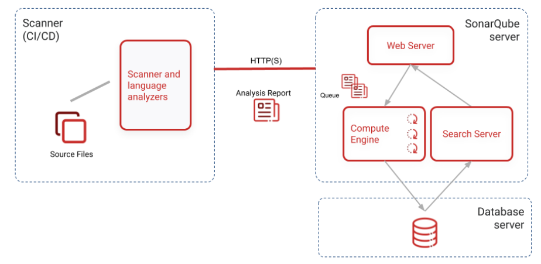

## Architecture
https://docs.sonarqube.org/latest/setup/install-server/


- One or more scanners running on your build or continuous integration servers to analyze projects.
- The SonarQube server running the following processes:
  - a web server that serves the SonarQube user interface.
  - a search server based on Elasticsearch.
  - the compute engine in charge of processing code analysis reports and saving them in the SonarQube database.
- The database to store the following:
    - Metrics and issues for code quality and security generated during code scans.  
    - The SonarQube instance configuration.

## SonarQube Server 
https://docs.sonarqube.org/latest/setup/install-server/  
https://devopscube.com/setup-and-configure-sonarqube-on-linux/  
https://computingforgeeks.com/install-sonarqube-code-review-centos/  
- Install PostgreSQL 13  
```sql
create database sonarqube;
create user sonarqube with encrypted password 'sonarqube';
grant all privileges on database sonarqube to sonarqube;
```
Elasticsearch listening on [HTTP: 127.0.0.1:9001, TCP: 127.0.0.1:44259]
Sonarqube listening on 9000
```sh
# Install Java 11
sudo yum update -y
sudo yum install java-11-openjdk-devel -y
# get the latest LTS download link from https://www.sonarqube.org/downloads/
cd /opt 
sudo wget https://binaries.sonarsource.com/Distribution/sonarqube/sonarqube-8.9.1.44547.zip
sudo unzip sonarqube-8.9.1.44547.zip
sudo mv sonarqube-8.9.1.44547 sonarqube
# Configure database connection
sudo nano /opt/sonarqube/conf/sonar.properties
sonar.jdbc.username=sonar
sonar.jdbc.password=sonar
sonar.jdbc.url=jdbc:postgresql://localhost/sonar
#sonar.web.port=10010

# Error: can not run elasticsearch as root
#sudo useradd sonar
sudo chown -R hai /opt/sonarqube
# Error: max virtual memory areas vm.max_map_count [65530] is too low, increase to at least [262144]
sudo nano /etc/sysctl.conf
vm.max_map_count=262144
fs.file-max=65536
sudo sysctl -p
# Error: Fail to connect to database
# web.log shows failed to connect PostgreSQL server.

# Test run
sudo ./sonar.sh console

# Run sonarqube as service
sudo nano /etc/systemd/system/sonarqube.service
sudo systemctl start sonarqube
sudo systemctl enable sonarqube
```
Sample service configuration
```ini
[Unit]
Description=SonarQube service
After=syslog.target network.target

[Service]
Type=forking
ExecStart=/opt/sonarqube/bin/linux-x86-64/sonar.sh start
ExecStop=/opt/sonarqube/bin/linux-x86-64/sonar.sh stop
LimitNOFILE=131072
LimitNPROC=8192
User=<username>
Group=<username>
Restart=on-failure

[Install]
WantedBy=multi-user.target
```

## From Sonarqube web UI
- Create project
- Copy the information to sonar-project.properties

## SonarScanner  
https://docs.sonarqube.org/latest/analysis/scan/sonarscanner/  
SonarScanner must run with a server.  
**Cli**  
This approach is for java projects not using maven.  
sonar-scanner -Dproject.settings=sonar-project.properties
```properties
# Sample sonar-project.properties for Java projects
sonar.host.url=<http://localhost:9000>
sonar.projectKey=<to be provided to you>
sonar.projectName=<to be provided to you> 
sonar.projectVersion=1.0
sonar.login=<token or userid to be provided to you> 
sonar.password=<to be provided to you> 
sonar.projectBaseDir=</home/ftpdrop/cobol/project1>
sonar.sources=src
sonar.java.source=1.11 
sonar.java.target=1.11 
sonar.language=java 
sonar.scm.disabled=true 
sonar.java.binaries=target/classes
sonar.java.libraries=<path/to/library>
sonar.ws.timeout=360 
```
**Maven**  
This approach is recommended as it integrate with build process.
mvn sonar:sonar -Dproject.settings=sonar-project.properties

## Export report
https://github.com/cnescatlab/sonar-cnes-report  


## ALM Integration Overview
https://docs.sonarqube.org/latest/architecture/architecture-integration/  
Refer to each ALM (e.g. [gitlab](../devops/gitlab.md)) for detailed integration.