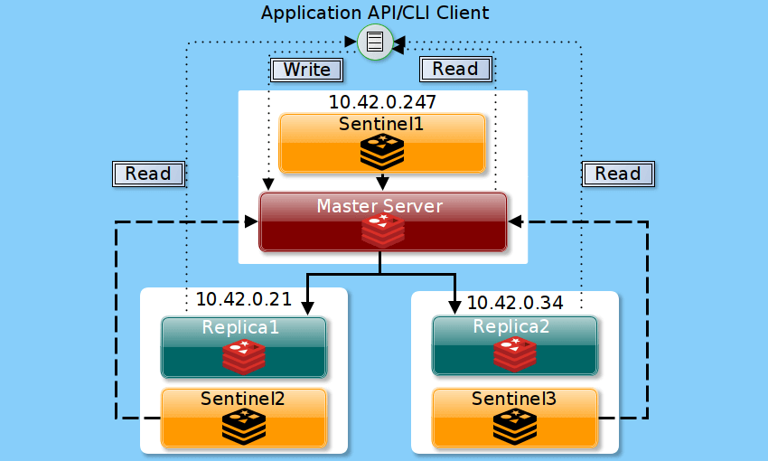

## Redis
https://cloudinfrastructureservices.co.uk/redis-sentinel-vs-cluster/  
https://redis.io/topics/sentinel  
**HA Mode (Failover)**:  Sentinel + 1 Master (Write/Read) - 2 or more Replicas (Read)  
- Primary/Replica, available in Redis OSS version.
- Sentinel handles failover.
- Write only to Primary node.
- Azure Cache for Redis Standard/Premium SKU use this version. In azure, Load Balancer has the same function as Sentinel.
  https://docs.microsoft.com/en-us/azure/azure-cache-for-redis/cache-high-availability#standard-replication-for-high-availability  
- For HA setup, basic setup with three boxes running both Redis and Sentinal.  

**Cluster**
- Only available in Redis Enterprise version.
- Write to multiple nodes.
- Azure Cache for Redis Enterprise SKU use this version.

**Sharding**  
In Redis, data sharding (partitioning) is the technique to split all data across multiple Redis instances so that every instance will only contain a subset of the keys.  
https://www.javacodegeeks.com/2015/09/redis-sharding.html#:~:text=In%20Redis%2C%20data%20sharding%20(partitioning,parts%20(shards%20or%20partitions).  

## Installation
**Centos 7**  
https://www.linode.com/docs/guides/install-and-configure-redis-on-centos-7/  
sudo nano /etc/redis.conf  
comment out bind so that it will accept connection to any address.

**Centos 8**  
https://www.tecmint.com/setup-redis-high-availability-with-sentinel-in-centos-8/  
NOTE:
- Part 1 - Must set to same password in all three nodes.  
- Part 2 - there is already a line of "sentinel monitor mymaster 127.0.0.1 6379 2", replace the ip.  
Use "journalctl -xe" command to view service error message.  
- Part 2 - for master node, "sentinel monitor mymaster 127.0.0.1 6379 2" is incorrect, must set to external ip address. e.g. "sentinel monitor mymaster 192.168.56.110 6379 2"

**How it works**  
Sentinal will update the configuration file /etc/redis-sentinel.conf dynamically when detecting master node failure.

However, when the master node down, replicas will not get update from new master even though client can still write/read from new master.

Sometimes telnet redis:6379 failed, need to restart the service in the case.

**Springboot Connection**  
Configure Sentinel Nodes in application.yml

