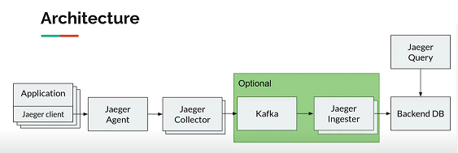

## Architecture

- Flow  
  jaeger client (application library, sending UDP to agent)  
  -> jaeger agent (run as sidecar with application for high volume, or deamonset).  
  -> jaeger collector  
  -> (Kafka) -> (jaeger ingester&indexer)  
  -> ElasticSearch  
  -> jaeger query -> jaeger UI
- 
- Sampling
  - Head-based Sampling  
    Always on/off, probabilistic, rate limiting.
  - Tail-based (post trace) Sampling
    Require storage and performance overhead. (21/6/21) Currently support single node only. 
  - Use REMOTE-SAMPLING is recommended so the Jaeger Operator can control the sampling. Jaeger default to remote sampler to allow central configuration.
  - My thought, since Sampling can control the tracing volume, it is better to run Jaeger Agent as daemonset???.

## Installation
https://medium.com/jaegertracing/a-guide-to-deploying-jaeger-on-kubernetes-in-production-69afb9a7c8e5  
https://medium.com/@klaus.dobbler/introducing-distributed-tracing-to-a-docker-swarm-landscape-f92c033e36db  
https://logz.io/blog/jaeger-and-the-elk-stack/

```sh
# Install
kubectl create namespace observability
# Create CRD
kubectl create -f https://raw.githubusercontent.com/jaegertracing/jaeger-operator/master/deploy/crds/jaegertracing.io_jaegers_crd.yaml
# permission
kubectl create -n observability -f https://raw.githubusercontent.com/jaegertracing/jaeger-operator/master/deploy/service_account.yaml
kubectl create -n observability -f https://raw.githubusercontent.com/jaegertracing/jaeger-operator/master/deploy/role.yaml
kubectl create -n observability -f https://raw.githubusercontent.com/jaegertracing/jaeger-operator/master/deploy/role_binding.yaml
# cluster-wise permission
kubectl create -f https://raw.githubusercontent.com/jaegertracing/jaeger-operator/master/deploy/cluster_role.yaml
kubectl create -f https://raw.githubusercontent.com/jaegertracing/jaeger-operator/master/deploy/cluster_role_binding.yaml
# download and customize the operator.yaml, setting the env var WATCH_NAMESPACE to have an empty value, so that it can watch for instances across all namespaces
kubectl create -n observability -f https://raw.githubusercontent.com/jaegertracing/jaeger-operator/master/deploy/operator.yaml
# create simple-prod.yaml
kubectl apply -f simple-prod.yaml

# Uninstall
kubectl delete -f simple-prod.yaml
kubectl delete -f https://raw.githubusercontent.com/jaegertracing/jaeger-operator/master/deploy/cluster_role.yaml
kubectl delete -f https://raw.githubusercontent.com/jaegertracing/jaeger-operator/master/deploy/cluster_role_binding.yaml
kubectl delete -n observability -f https://raw.githubusercontent.com/jaegertracing/jaeger-operator/master/deploy/operator.yaml
kubectl delete -n observability -f https://raw.githubusercontent.com/jaegertracing/jaeger-operator/master/deploy/role_binding.yaml
kubectl delete -n observability -f https://raw.githubusercontent.com/jaegertracing/jaeger-operator/master/deploy/role.yaml
kubectl delete -n observability -f https://raw.githubusercontent.com/jaegertracing/jaeger-operator/master/deploy/service_account.yaml
kubectl delete -n observability -f https://raw.githubusercontent.com/jaegertracing/jaeger-operator/master/deploy/crds/jaegertracing.io_jaegers_crd.yaml
```

## Deploy
Jaeger Client  
https://github.com/opentracing-contrib/java-spring-jaeger  
- RestController call will be traced by default.
- Set service name in application.yml
- Add annotation "sidecar.jaegertracing.io/inject"="true" to Applicatiaon Deployment.  
  ```yaml
  annotations:
    "sidecar.jaegertracing.io/inject": "true"
  ```

Development
- jaegertracing All-in-One  
  https://www.jaegertracing.io/docs/1.24/getting-started/  
  docker run -d --name jaeger -p 16686:16686 -p 6831:6831/udp jaegertracing/all-in-one:1.24.0  

Production (Jaeger Operator)  
https://www.jaegertracing.io/docs/1.24/operator/  
https://www.youtube.com/watch?v=VDGr79WX11I  

**Install Jaeger Operator**  
```sh
# create namespace
kubectl create namespace observability
# create CRD, ServiceAccount, Role
kubectl create -f https://raw.githubusercontent.com/jaegertracing/jaeger-operator/master/deploy/crds/jaegertracing.io_jaegers_crd.yaml
kubectl create -n observability -f https://raw.githubusercontent.com/jaegertracing/jaeger-operator/master/deploy/service_account.yaml
kubectl create -n observability -f https://raw.githubusercontent.com/jaegertracing/jaeger-operator/master/deploy/role.yaml
kubectl create -n observability -f https://raw.githubusercontent.com/jaegertracing/jaeger-operator/master/deploy/role_binding.yaml
# install operator
wget https://raw.githubusercontent.com/jaegertracing/jaeger-operator/master/deploy/operator.yaml  
nano operator.yaml
#  args: ["start", "--log-level=debug"]
#        - name: WATCH_NAMESPACE
#          value: ""
#        - name: POD_NAMESPACE
#          value: ""
kubectl create -n observability -f operator.yaml
```
**Create Jaeger instance**  
```sh
nano jaeger.yaml  
kubectl create -n observability -f jaeger.yaml   
```
```yaml
apiVersion: jaegertracing.io/v1
kind: Jaeger
metadata:
  name: jaeger
spec:
  strategy: production
  collector:
    maxReplicas: 10
    resources:
      limits:
        cpu: 100m
        memory: 128Mi
  storage:
    type: elasticsearch
    options:
      es:
        server-urls: http://20.198.168.114:9200
```

**Check log**  
```sh
kubectl logs deployment/jaeger-operator -n observability
```

**Uninstall**  
```sh
kubectl delete -n observability -f jaeger.yaml
kubectl delete -n observability -f operator.yaml
kubectl delete -n observability -f https://raw.githubusercontent.com/jaegertracing/jaeger-operator/master/deploy/role_binding.yaml
kubectl delete -n observability -f https://raw.githubusercontent.com/jaegertracing/jaeger-operator/master/deploy/role.yaml
kubectl delete -n observability -f https://raw.githubusercontent.com/jaegertracing/jaeger-operator/master/deploy/service_account.yaml
kubectl delete -n observability -f https://raw.githubusercontent.com/jaegertracing/jaeger-operator/master/deploy/crds/jaegertracing.io_jaegers_crd.yaml

```
Ingress
- Disable Ingress
  ```yaml
  spec:
    ingress:
      enabled: false
  ```
